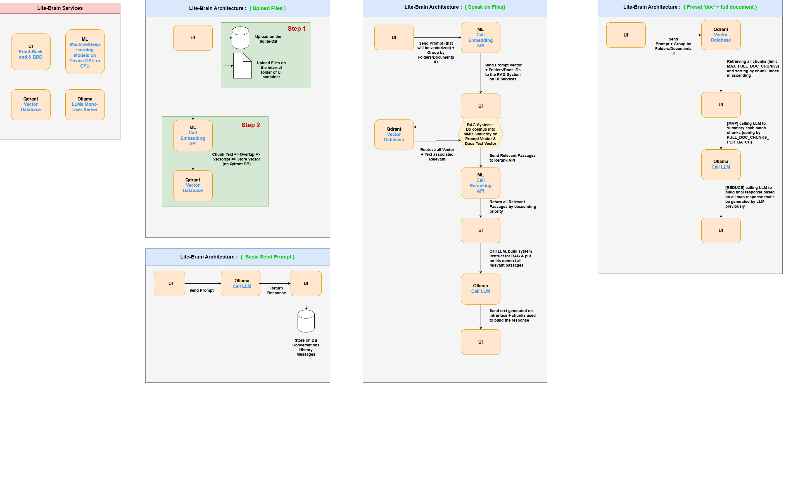

# **Lite-Brain**

**Lite-Brain** is a **lightweight**, **fast**, and **high‑performance**
application designed to run on **mid‑range to high‑range computers**.
It allows users to have **their own local artificial brain**, with a
clean interface that covers **90% of typical everyday needs**.

---

## 🚀 **Setup**

Click on the launcher **LiteBrainLauncher.exe**. Do your configuration and start !

---

## 🎯 **Goals**

-   Reduce dependency on large LLMs (ChatGPT, Claude, etc.) for standard
    tasks.
    → Lower environmental cost, fully local processing, **no data
    leakage**.

-   Runs smoothly on a PC with a **small RTX GPU**.

-   Three modes available from the home screen or a dropdown menu:
    - 🌿 **Classic Mode** (recommended) --- fast and lightweight
    - ⚡ **Turbo Mode** --- more accurate but more resource‑intensive
    - ⚡⚡ **Ultra Mode** --- highly accurate, requires a strong machine

---

## 🧠 **Features**

### 1. **Writing & Rewriting Assistance**

-   Write emails, messages, letters, articles, reports.
-   Rewrite, simplify, or enhance text.
-   Grammar/spelling/style correction.
-   Generate summaries (text, PDF, transcripts).

### 2. **Document Synthesis & Analysis**

-   Extract key information from files, images, notes, PDFs.
-   Summaries, key points, digests.
-   Search within your local documents.
-   Q&A based on local files (PDF, DOCX, Markdown, TXT...).

### 3. **Brainstorming & Idea Generation**

-   Project ideas, posts, titles, slogans.
-   Arguments and counter‑arguments.
-   Create plans and structured steps.

### 4. **Programming Assistance**

-   Explain code.
-   Fix or complete simple functions.
-   Generate small scripts (Python, JS, Bash...).
-   Create documentation or comments.

### 5. **Learning & Concept Explanation**

-   Simplify complex concepts.
-   Provide examples and analogies.
-   Create quizzes or exercises.

### 6. **Translation & Style Adaptation**

-   Fast language translation.
-   Rewriting for tone, audience, level.
-   Adapt content to technical, marketing, etc.

### 7. **Organization & Planning**

-   Generate action plans, calendars, to‑do lists.
-   Structure projects or summaries.
-   Brainstorm outlines for articles or training content.

### 8. **Conversational Assistant**

-   A fully local chat assistant.
-   General advice (productivity, habits, organization...).

---

## 🛠️ **Tech Stack**

-   **UI:** FastAPI
    -   Front: Jinja / HTMX / Tailwind
    -   Backend + SQLite (light mono‑user DB)
    -   File upload and RAG systems.
-   **ML:** FastAPI
    - Embeddings *bge‑m3*
    - OCR
    - Reranking *bge-v2-v3*
    - Transcription *whisper* **TO DO LATER**
-   **Ollama:** LLM server 
    - Qwen3:4B *for Classic Mode*
    - Qwen3:8B *for Turbo Mode*
    - Qwen3:14B *for Ultra Mode*
-   **Qdrant:** Vector database
    -   Command for Docker Local run:
        ``` bash
        docker run --name temp_qdrant -p 6333:6333 -v qdrant_storage:/qdrant/storage qdrant/qdrant:v1.15
        ```

For building the **LiteBrainLauncher.exe** i use *pyinstaller* and run the command : ```pyinstaller launcher.py --onefile --name "LiteBrainLauncher"```

---

## 🧩 **Architecture Schema**


